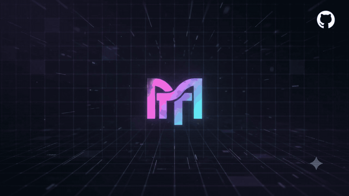

<p align="center"></p>

<p align="center">
  <a href="https://github.com/domovoyproj/momp/releases"></a>
  <a href="https://github.com/domovoyproj/momp/blob/main/LICENSE"></a>
</p>

<p align="center">
  Форк <a href="https://github.com/ddallabenetta/omp-web">omp-web</a>
</p>

Веб-интерфейс для **momp max** ([oh-my-pi](https://github.com/can1357/oh-my-pi)). Сам агент по-прежнему работает как обычно, momp просто даёт ему рабочее пространство в браузере: список сессий с возможностью продолжить или разветвить любую из них, чат в реальном времени, настройка моделей по ролям, мониторинг лимитов провайдеров, управление плагинами и навыками (skills), просмотр файлов проекта рядом с диалогом.

## Установка

**Windows, один `.exe`.** Скачать [`momp.exe`](https://github.com/domovoyproj/momp/releases/latest/download/momp.exe) со [страницы релизов](https://github.com/domovoyproj/momp/releases/latest) и запустить. При первом старте он распаковывает рантайм в `%LOCALAPPDATA%\momp`, дальше открывается обычным окном приложения. Новые версии подтягиваются в фоне сами. Bun, Node.js и Git для этого не нужны.

**CLI, любая ОС.** Скрипт проверяет наличие Bun (ставит, если его нет), тянет готовую сборку с релиза и делает команду `momp` доступной глобально в терминале.

PowerShell:

```powershell
irm https://raw.githubusercontent.com/domovoyproj/momp/main/install.ps1 | iex
```

Bash:

```bash
curl -fsSL https://raw.githubusercontent.com/domovoyproj/momp/main/install.sh | bash
```

Если готовой сборки с релиза нет, скрипт откатывается на клонирование репозитория и сборку из исходников на месте — это дольше.

## Запуск

Desktop-версия — ярлык `momp` на рабочем столе или в меню «Пуск». Для CLI:

```bash
momp
```

Приложение поднимется локально и само откроет браузер на `http://127.0.0.1:30141`.

```bash
momp --port 8080              # другой порт
momp --hostname 0.0.0.0       # доступ из локальной сети
momp -p 8080 -H 0.0.0.0       # порт и хост вместе
momp --no-open                # не открывать браузер автоматически
momp --authenticated          # включить обязательный пароль
momp --reset-password         # сбросить и задать новый пароль
```

## Доступ по паролю

Интерфейс и все API-запросы можно закрыть HTTP Basic Auth (логин всегда `omp`, пароль — единственный секрет). Включается тремя способами: из браузера (Settings → Access), флагом `momp --authenticated` при запуске (спросит пароль в терминале, если его ещё не было), либо переменной `OMP_WEB_PASSWORD`, которая временно перекрывает сохранённый пароль.

Сам пароль нигде не хранится в открытом виде — только scrypt-хэш в `~/.omp/agent/omp-web-auth.json` с правами `0600`. Забыли пароль — `momp --reset-password` с той же машины, либо страница `/recover`: она печатает одноразовый код в консоль сервера (не в HTTP-ответ), код действует 10 минут и одноразовый.

Это защита от порт-сканера, а не от прослушки трафика — Basic Auth не шифрует. За пределами loopback momp стоит держать за HTTPS-прокси или в VPN.

## Роли моделей

В momp нет одной модели на всё — для каждой задачи используется своя роль, как у селектора `/model` в терминале:

| Роль | Назначение |
| --- | --- |
| `default` | Основная модель для обычных запросов |
| `smol` | Быстрая и недорогая модель для фоновых под-агентов |
| `slow` | Модель для глубокого рассуждения и сложных задач |
| `plan` | Модель для режима планирования |
| `commit` | Генерация сообщений коммитов и changelog |
| `task` | Модель для выполнения изолированных задач |
| `advisor` | Модель-советник для анализа ответов |
| `vision`, `designer`, `tiny` | Работа с изображениями, UI-дизайн и классификация |

Настроить роли можно двумя способами: прямо в строке ввода чата (быстрое переключение для текущей сессии) или в «Модели → Роли моделей» (глобальное назначение, сохраняется в `~/.omp/agent/config.yml`).

## HTTP-прокси

momp читает стандартные `HTTP_PROXY` и `HTTPS_PROXY` для обращения к внешним API моделей:

```powershell
$env:HTTP_PROXY = "http://127.0.0.1:7890"
$env:HTTPS_PROXY = "http://127.0.0.1:7890"
momp
```

```bash
HTTP_PROXY=http://127.0.0.1:7890 HTTPS_PROXY=http://127.0.0.1:7890 momp
```

Запросы к `127.0.0.1`/`localhost` не проксируются, так что локальные модели (Ollama, LM Studio, vLLM) продолжают работать напрямую.

## Что внутри

- Боковая панель с сессиями, сгруппированными по проекту, и деревом файлов; сессию можно продолжить, разветвить (fork) или откатиться к любому предыдущему сообщению.
- Git worktrees в сайдбаре: переключение между ними, создание нового под веткой, просмотр статуса и diff по конкретному файлу.
- Чат по SSE с потоковым выводом вызовов инструментов и отдельной панелью для сабагентов — статус, длительность, использованные инструменты, транскрипт.
- Просмотр файлов проекта во вкладках рядом с чатом: код с подсветкой, markdown с превью, изображения, PDF, DOCX.
- Настройка провайдеров и моделей, ролей, мониторинг остатка лимитов и баланса по провайдерам.
- Управление плагинами, навыками (skills) и MCP-серверами без терминала, полный редактор настроек omp.
- Экран доверия проекту: расширения, хуки, кастомные инструменты и MCP из открытого репозитория запускаются только после явного подтверждения в браузере.
- Работает как устанавливаемое PWA, интерфейс подстраивается под мобильный экран.
- Интерфейс на русском, английском и китайском (zh-CN).

## Скриншоты

**Навигация по сессиям и проводник файлов проекта**


**Чат в реальном времени с вызовами инструментов и ролями моделей**


**Предпросмотр файлов рядом с диалогом**


**Настройка моделей и ролей**


**Светлая и тёмная темы оформления**


## Хранение данных

- Сессии: `~/.omp/agent/sessions/<encoded-cwd>/<timestamp>_<uuid>.jsonl`.
- Модели и провайдеры: `~/.omp/agent/models.yml`; ключи и OAuth-креды — в SQLite `~/.omp/agent/agent.db`.
- Доверенные проекты: `~/.omp/agent/omp-web-trusted-projects.json` (подробнее — `docs/project-trust.md`).
- Навыки ставятся через `npx skills add --agent claude-code` в `.claude/skills` / `~/.omp/agent/skills`.

## Разработка

```bash
bun install
bun run dev
```

Сервер разработки поднимется на `http://127.0.0.1:30141`.

```bash
bun run typecheck   # проверка типов TypeScript
bun run lint        # ESLint
bun test            # тесты (bun test, не node --test — SDK импортирует bun:sqlite)
```

`bun run build` во время разработки не запускать — ломает `.next/`, на котором держится `bun run dev`. Для десктоп-сборки есть отдельный `bun run desktop:build`, он собирает в свою директорию и dev-сборку не трогает.

## Десктоп-версия (Tauri)

`src-tauri/` — оболочка на Tauri v2 вокруг того же Next.js-сервера, с автообновлением через встроенный updater.

```bash
bun run desktop:dev     # запуск десктопного приложения в режиме разработки
bun run desktop:build   # сборка momp.exe
```

## Структура проекта

```text
app/api/
  agent/          создание сессий, отправка команд, SSE-поток событий
  sessions/       список, чтение, переименование, удаление, экспорт сессий
  auth/           OAuth и API-ключи через AuthStorage
  models/, models-config/   список моделей/провайдеров, чтение-запись models.yml, лимиты
  model-roles/    чтение и запись ролей моделей
  plugins/        управление плагинами omp
  skills/         поиск, установка, включение/выключение навыков
  mcp/            управление MCP-серверами (user/project scope)
  settings/       редактор конфигурации omp (полная схема настроек)
  project-trust/  доверие проектам для запуска расширений из браузера
  worktrees/      список, создание, удаление git worktree
  git/            статус и diff файла в рабочей директории
  files/          чтение файлов для просмотрщика
  cwd/, default-cwd/, home/   выбор и валидация рабочей директории
  web-access/     пароль (Settings → Access) и восстановление
  updates/        проверка версий для автообновления desktop-версии
components/
  AppShell.tsx        общий layout, вкладки файлов, мобильная раскладка
  SessionSidebar.tsx  сессии, проекты, worktrees, файловый проводник
  ChatWindow.tsx / ChatInput.tsx / MessageView.tsx   чат, поле ввода, рендер сообщений
  SubagentPanel.tsx   статус и транскрипт запущенных сабагентов
  BranchNavigator.tsx переключение веток внутри одной сессии
  FileExplorer.tsx / FileViewer.tsx   дерево файлов и просмотрщик содержимого
  ModelsConfig.tsx / ModelRolesPanel.tsx   провайдеры, модели, роли
  PluginsConfig.tsx / SkillsConfig.tsx     управление плагинами и навыками
  SettingsConfig.tsx / AccessConfig.tsx    настройки omp и пароль доступа
  ProjectTrustDialog.tsx   диалог подтверждения доверия проекту
lib/
  omp-runtime.ts      общий инстанс Settings + AuthStorage + ModelRegistry
  rpc-manager.ts      жизненный цикл AgentSession
  session-reader.ts   чтение и парсинг .jsonl файлов сессий
  worktree.ts         операции с git worktree
  project-trust.ts    проверка доверия проекту
  file-access.ts      allow-list путей для /api/files
  i18n/               переводы интерфейса (en, ru, zh-CN)
hooks/
  useAgentSession.ts  загрузка сессии, отправка команд, SSE
  useTheme.ts, useI18n.tsx, useIsMobile.ts, useDragDrop.ts, useKeyboardShortcuts.ts
bin/
  omp-web.js          точка входа CLI, запуск сервера через Bun
  web-auth-store.js   хранение и проверка пароля, общий для лаунчера и сервера
src-tauri/            десктоп-обёртка (Tauri v2) с автообновлением
```
