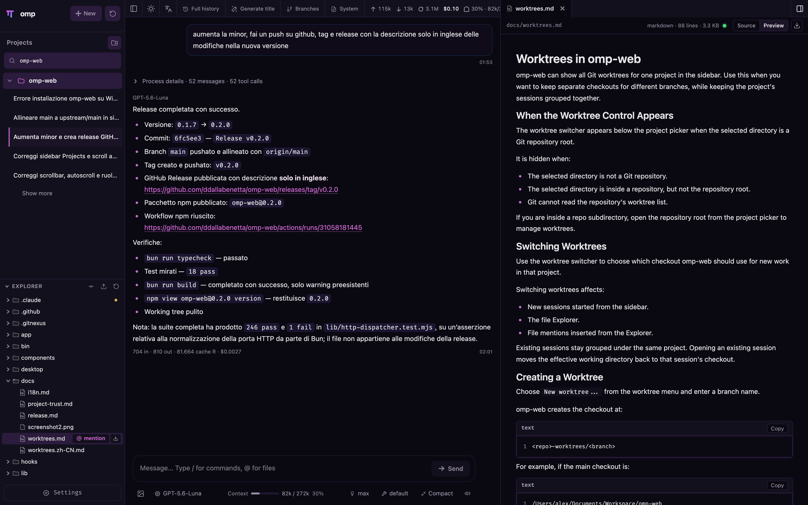
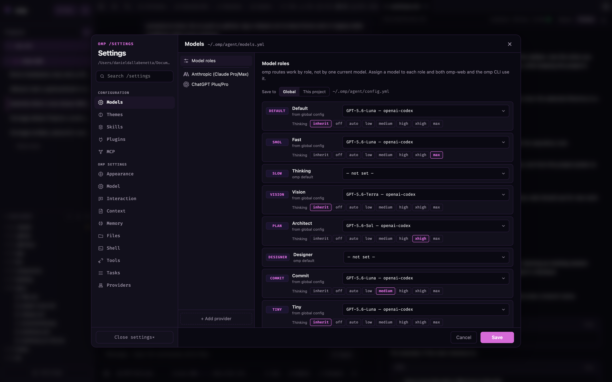
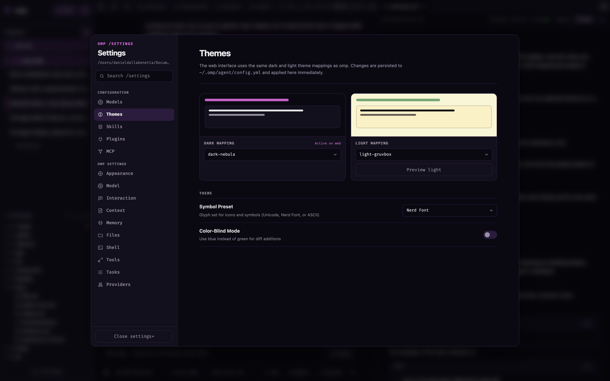

<p align="center">
  <a href="https://github.com/domovoyproj/momp/releases"></a>
  <a href="https://github.com/domovoyproj/momp/blob/main/LICENSE"></a>
  <a href="https://www.typescriptlang.org"></a>
  <a href="https://bun.sh"></a>
</p>

<p align="center">
  Fork of <a href="https://github.com/ddallabenetta/omp-web">omp-web</a>
</p>

Веб-интерфейс для **momp max**. momp-web предоставляет удобное рабочее пространство в браузере: просмотр сессий, чат в реальном времени, настройку ролей моделей, мониторинг лимитов, управление навыками и предпросмотр файлов проекта.


## ⚡ Быстрая установка в 1 команду

Вы можете установить и настроить **momp max** одной командой в терминале. Скрипт сам проверит и установит Bun, скачает последнюю версию приложения, выполнит сборку и сделает команду `momp` доступной из любой папки.

### Для Windows (PowerShell):
Откройте PowerShell и выполните:
```powershell
irm https://raw.githubusercontent.com/domovoyproj/momp/main/install.ps1 | iex
```

### Для Linux / macOS (Bash):
```bash
curl -fsSL https://raw.githubusercontent.com/domovoyproj/momp/main/install.sh | bash
```

---

## 🚀 Запуск

После завершения установки просто введите в любом терминале:
```bash
momp
```
Приложение запустится локально и автоматически откроет веб-интерфейс в браузере по адресу [http://127.0.0.1:30141](http://127.0.0.1:30141).

---

## 🛠 Ручная установка и запуск из исходников

Если вы хотите запустить проект напрямую из локальной папки:

1. **Установите Bun** (если ещё не установлен):
   ```powershell
   powershell -c "irm bun.sh/install.ps1 | iex"   # Windows
   curl -fsSL https://bun.sh/install | bash       # Linux/macOS
   ```
2. **Установите зависимости и соберите проект**:
   ```bash
   bun install
   bun run build
   ```
3. **Запустите сервер**:
   ```bash
   bun run start
   ```


## Password access

A password locks the web interface and every API endpoint behind HTTP Basic Auth, with the fixed username `omp`. Turn it on wherever suits you:

- **Settings → Access** in the browser, to set the password and switch the lock on or off.
- **`momp-web --authenticated`**, which turns it on for this run and every later one, and asks for a password on the terminal if none has been set yet.
- **`OMP_WEB_PASSWORD`**, which overrides the stored credential for as long as it is set.

The password is stored as a `scrypt` hash in `~/.momp/agent/momp-web-auth.json` (mode `0600`) — never in plaintext, and never recoverable from the file. Forgotten it? Run `momp-web --reset-password` on the server, or open `/recover` and enter the one-time code momp-web prints on its own console.

momp-web can invoke a high-privilege agent. Basic Auth does not encrypt the password in transit, so do not expose plain HTTP to the internet. Use HTTPS through a trusted reverse proxy or a trusted VPN for remote access.
API requests accept loopback names, IP literals, the selected bind hostname, and exact comma-separated names in `OMP_WEB_ALLOWED_HOSTS`. Configure that variable when a trusted reverse proxy uses a different external hostname.

Full details, including the recovery threat model: [docs/authentication.md](./docs/authentication.md).

## Model roles

omp does not have "the" model — it has a model per **scope of work**, and momp-web exposes the same roles the TUI's `/model` selector and `Ctrl+P` cycle use:

| Role | What it runs |
| --- | --- |
| `default` | ordinary turns |
| `smol` | cheap, fast subagent and background work |
| `slow` | deep reasoning on hard problems |
| `plan` | plan mode |
| `commit` | commit messages and changelogs |
| `task` | the model subagents spawn with |
| `advisor` | the second model that reviews every turn |
| `vision`, `designer`, `tiny` | image turns, design work, classification |

Two places surface them:

- **The model picker in the chat bar** lists the configured roles above the flat model list. Picking one switches the session onto that role's model *and records the role*, exactly like `/model` does, so the transcript and omp's retry fallbacks agree on which role is driving.
- **Models → Model roles** assigns a model to each role. Writes go to `modelRoles` in `~/.momp/agent/config.yml` (or `.omp/config.yml` when you pick **This project**), which is the same record the CLI reads — an assignment made in the browser is what your next terminal session starts with.

Session titles follow the same routing: momp-web asks omp to name a session, and omp resolves that through the `tiny` → `commit` → `smol` chain rather than the session's primary model.

## HTTP Proxy

momp-web reads the standard `HTTP_PROXY` and `HTTPS_PROXY` environment variables for server-side model and API requests. Bun reads them once at process start, so set them before launching:

On macOS or Linux:

```bash
HTTP_PROXY=http://127.0.0.1:7890 \
HTTPS_PROXY=http://127.0.0.1:7890 \
bunx momp-web@latest
```

On Windows PowerShell:

```powershell
$env:HTTP_PROXY = "http://127.0.0.1:7890"
$env:HTTPS_PROXY = "http://127.0.0.1:7890"
bunx momp-web@latest
```

Requests to loopback addresses are never proxied, so a local provider (Ollama, LM Studio, llama.cpp) keeps working with a proxy configured. Note that Bun does **not** currently honour `NO_PROXY` for other hosts.

## Features

- **Pick work back up**: browse previous omp conversations by project without digging through terminal history or session paths.
- **Route by role**: assign and switch models per scope of work — the roles omp already uses for subagents, plan mode, and commits.
- **Try different directions safely**: continue from an earlier message or fork a session into a separate route.
- **Work across branches**: switch Git worktrees from the sidebar so new sessions and the Explorer follow the checkout you choose.
- **Chat beside the project**: browse files on the left and preview source, docs, images, audio, and PDFs on the right while the agent works.
- **See session state clearly**: context usage, cost, compaction state, and system prompt details are visible from the top bar.
- **Configure less from the terminal**: manage providers, logins/API keys, model tests, plugins, and skill switches from the web UI.
- **Use the interface in your language**: switch between the supported UI languages from the top bar.

## Screenshots

**Session browsing + file explorer** — projects and past sessions on the left, the project's real file tree underneath, ready to preview or attach to a message.


**Real-time chat with model roles** — the agent's tool calls, cost, context usage, and the active model role are all visible while it works.


**Chat beside the project** — browse and preview a file next to the conversation without losing your place.



**Model roles, configured once, used everywhere** — assign a model per role (`default`, `smol`, `plan`, `commit`, …); both momp-web and the omp CLI read the same `models.yml`.



**Full omp theme support** — momp-web reads omp's own dark/light palette mappings from `~/.momp/agent/config.yml` and applies them live, so the web view matches the terminal.



## Notes

- **Data directory**: momp-web reads `~/.momp/agent/sessions` by default. Set `PI_CODING_AGENT_DIR` to point at another omp agent directory (omp kept the variable name).
- **Session files**: files are stored as `~/.momp/agent/sessions/<encoded-cwd>/<timestamp>_<uuid>.jsonl`.
- **Provider config**: the Models panel reads and writes `models.yml` in the omp agent directory. Credentials live in omp's `agent.db`, shared with the CLI. A header value that names an environment variable (bare name, no `$`) is substituted at request time.
- **Project trust**: opening a repository in a browser tab must not run its code, so momp-web gates a project's `.omp/extensions`, `.omp/hooks`, `.omp/tools` and `.mcp.json` behind an explicit trust decision. Skills and rules are data and load either way. See [Project trust](./docs/project-trust.md).
- **File access**: file browsing and preview are scoped to the selected project directory and working directories that appear in sessions.
- **Git worktrees**: see [Worktrees in momp-web](./docs/worktrees.md) for when the switcher appears, how new worktrees are created, and what removal does.
- **Forks vs in-session branches**: Fork creates a new `.jsonl` file. "Edit from here" creates another branch inside the same session file.
- **Skills**: the skill installer shells out to `npx skills add --agent claude-code`, which writes the `.claude/skills` layout omp discovers by default.
- **Internationalization**: see [Internationalization](./docs/i18n.md) for using translations and adding languages or UI text.

### Downstream Session Context Menu

Electron wrappers and other downstream integrations can provide a session-row
context menu without patching `SessionSidebar`. Listen for the cancelable
`pi-web:session-row-contextmenu` browser event and call `preventDefault()`
synchronously when the integration will handle it:

```js
window.addEventListener("pi-web:session-row-contextmenu", (event) => {
  event.preventDefault();
  const { id, path, cwd, name, clientX, clientY, refresh } = event.detail;

  void openSessionMenu({ id, path, cwd, name, clientX, clientY }).then((changed) => {
    if (changed) refresh();
  });
});
```

The detail object contains `id`, `path`, `cwd`, optional `name`, pointer
coordinates, and a `refresh()` callback for actions that change the session
list. If no listener cancels the extension event, Pi Web preserves the
browser's native context menu. This hook is browser-side and independent of
Pi agent extensions.

## Development

```bash
bun install
bun run dev
```

The local dev server runs at [http://127.0.0.1:30141](http://127.0.0.1:30141).

Common checks:

```bash
bun run typecheck
bun run lint
bun test
```

Avoid running `bun run build` during local development. It writes to `.next/` and can interfere with the dev server; leave builds for release work.

## Desktop (Tauri)

`src-tauri/` is a Tauri v2 shell that runs this same app as a desktop
application: the webview loads the Next.js server, which is started as a Bun
sidecar on a free loopback port. Desktop and CLI share `~/.omp`, so sessions,
credentials and model config are identical across both.

Requires a Rust toolchain in addition to Bun. Useful commands (all defined in
`package.json`):

```bash
bun run desktop:dev          # tauri dev — runs `bun run dev` and opens the webview
bun run desktop:build        # stages the payload (build + production deps) and bundles
bun run desktop:fetch-bun    # downloads pinned Bun binaries into src-tauri/resources/
bun run desktop:sync-version # aligns src-tauri/ versions with package.json
bun scripts/stage-desktop.mjs --skip-build  # re-stage without rebuilding next
bun scripts/build-updater-json.mjs <tag>  # (re)generates latest.json for a release
```

`desktop:build` stages the server payload into `src-tauri/server/` (gitignored):
a production `next` build via `OMP_WEB_DIST_DIR` (the dev `.next/` is never
touched), production-only dependencies, and the Bun runtime(s) for the host
platform. The CI stage step passes `--universal`, which also bundles both
macOS architectures' native runtimes (SWC + pi-natives) for the universal
app. The bundle stays lean: no devDependencies, no webpack cache, no optional
dependencies (onnxruntime/transformers.js for local embeddings — the
platform's native runtimes are kept: `next start` and the SDK's workspace
tree load them eagerly, and a missing SWC would otherwise trigger a
package-manager download that fails in a GUI app), no client-only stats UI —
while keeping the agent's PDF and browser tools (mupdf, puppeteer-core).
Payload ~700MB, dmg ~250MB.

Pushing a `v*` tag triggers `.github/workflows/publish-desktop.yml`: it builds
macOS (universal) and Windows bundles, uploads them to a GitHub release with
Ed25519 signatures, and generates the updater manifest (`latest.json`). The
updater fetches
`https://github.com/ddallabenetta/momp-web/releases/latest/download/latest.json`.
To enable that, configure two repository secrets — `TAURI_SIGNING_PRIVATE_KEY`
(contents of `~/.omp/momp-web/omp-desktop-signing.key`, generated by
`bun run desktop:signer generate`) and `TAURI_SIGNING_PRIVATE_KEY_PASSWORD`.
macOS builds are unsigned: the first launch needs right-click → Open (Gatekeeper),
subsequent auto-updates are written by the app itself.

## Project Structure

```text
app/
  api/
    agent/          # creates/drives AgentSession and exposes SSE events
    auth/           # OAuth and API key management through omp's AuthStorage
    cwd/browse/     # browsable server directory listing
    cwd/validate/   # custom working directory validation
    default-cwd/    # momp default working directory lookup
    files/          # file listing, reading, preview, and watching
    home/           # current user home directory
    model-roles/    # read/write omp's modelRoles (default/smol/slow/plan/…)
    models/         # available models, default model, thinking levels, roles
    models-config/  # read/write models.yml and test models
    plugins/        # omp plugin install/remove/enable/disable
    sessions/       # session reads, rename, delete, context, HTML export
    skills/         # skill listing, search, install, enable/disable
components/
  AppShell.tsx        # main layout, URL state, top panels, file tabs
  SessionSidebar.tsx  # project selector, session tree, Explorer
  DirectoryPicker.tsx # browsable and editable working-directory picker
  ChatWindow.tsx      # messages, SSE, image drag/drop, minimap
  ChatInput.tsx       # input bar, model/role/tools/thinking/compact/slash controls
  MessageView.tsx     # message, thinking, tool call/result rendering
  ModelsConfig.tsx    # provider and auth configuration panel
  ModelRolesPanel.tsx # per-role model assignment
  SkillsConfig.tsx    # skill management panel
  FileExplorer.tsx    # file tree
  FileViewer.tsx      # source, diff, image, audio, PDF, DOCX preview
lib/
  directory-browser.ts # directory normalization and safe listing helpers
  http-dispatcher.ts  # HTTP(S) proxy setup for server-side fetch
  model-roles.ts      # omp's model roles, read and written for the browser
  model-scope.ts      # enabledModels resolution shared by UI and startup
  omp-runtime.ts      # shared Settings + AuthStorage + ModelRegistry
  omp-types.ts        # structural view of omp's AgentSession
  project-trust.ts    # gates a project's executable resources
  rpc-manager.ts      # AgentSessionWrapper lifecycle and global registry
  session-reader.ts   # parses .jsonl session files and branch contexts
  normalize.ts        # normalizes toolCall field names
  file-access.ts      # file read safety boundary
  file-paths.ts       # path encoding and relative path helpers
  markdown.ts         # Markdown/Mermaid/KaTeX plugin configuration
hooks/
  useAgentSession.ts  # session loading, command sending, SSE state machine
  useAudio.ts         # completion sound
  useDragDrop.ts      # image drag/drop
  useTheme.ts         # theme switching
bin/
  momp-web.js          # CLI entrypoint; re-executes the server under Bun
  runtime.js          # Node/Bun version checks and Bun discovery
instrumentation.ts    # initializes the server HTTP dispatcher
```
