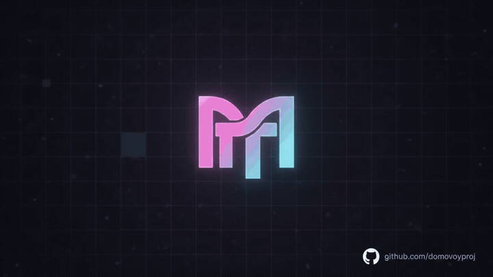
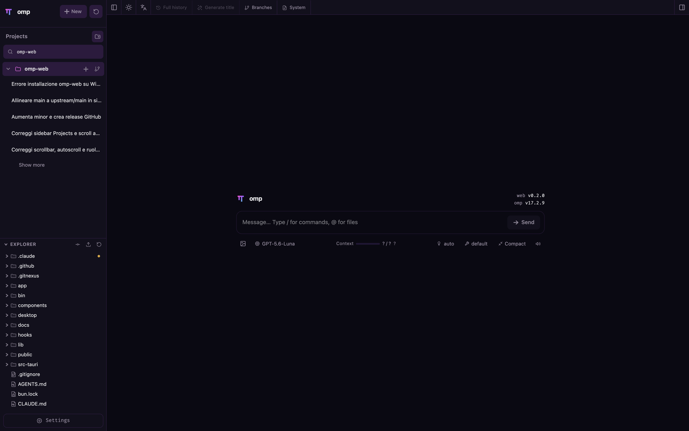
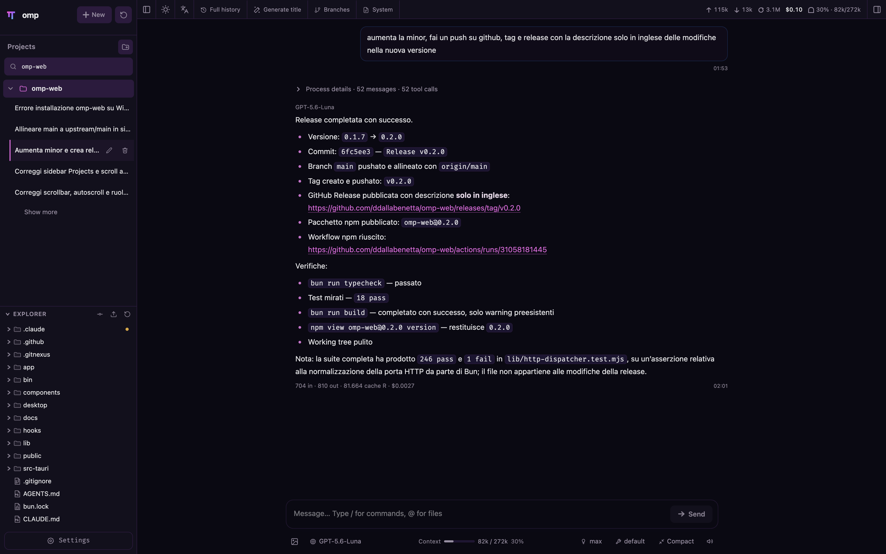
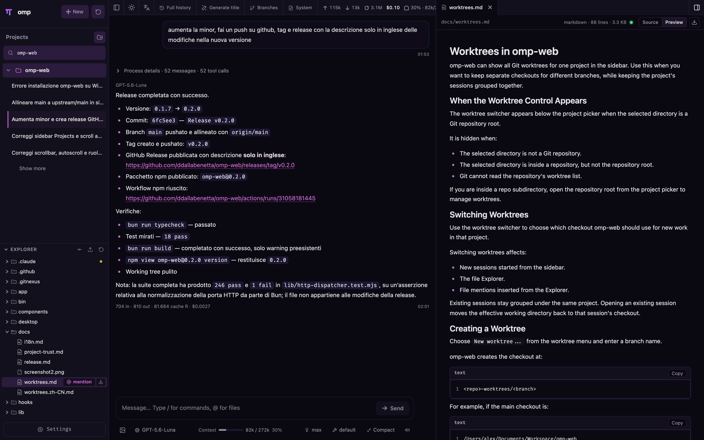
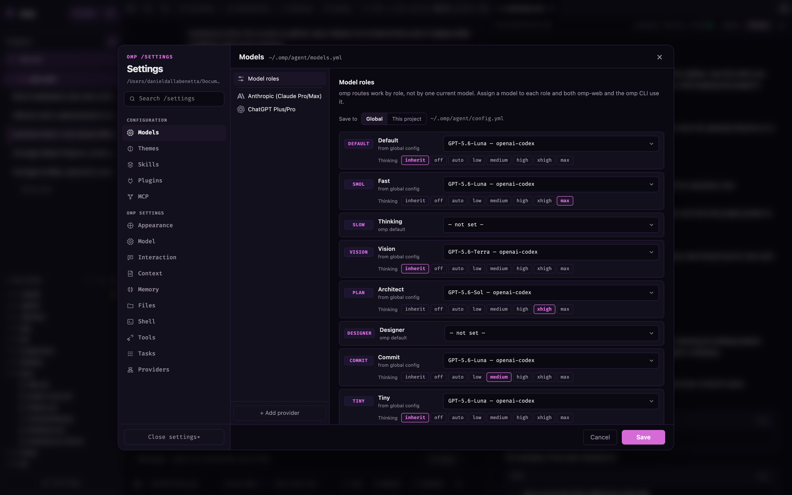
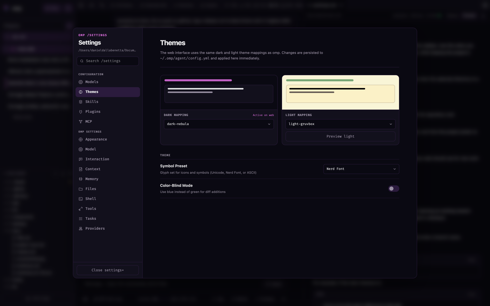

# ⚡ momp — Modern Web & Desktop GUI for Oh My Pi

<p align="center">
  
</p>

<p align="center">
  <a href="https://github.com/domovoyproj/momp/releases"></a>
  <a href="https://github.com/domovoyproj/momp/actions/workflows/publish-dist.yml"></a>
  
  
  
  
  <a href="https://github.com/domovoyproj/momp/blob/main/LICENSE"></a>
</p>

<p align="center">
  Форк <a href="https://github.com/ddallabenetta/omp-web">omp-web</a> • Совместимо с <b><a href="https://github.com/can1357/oh-my-pi">oh-my-pi</a></b>
</p>

Современный веб-интерфейс и десктопное приложение для **momp max** ([oh-my-pi](https://github.com/can1357/oh-my-pi)). Сам автономный агент работает как обычно, а momp предоставляет полноценное интерактивное рабочее пространство: древовидный список сессий с ветвлением (fork), чат в реальном времени с поддержкой Server-Sent Events, матричную настройку ролей моделей, мониторинг лимитов и квот провайдеров, управление плагинами, навыками (skills) и встроенный просмотрщик файлов проекта.

---

## 📦 Установка

### Windows (Автономный `.exe`)
Скачайте [`momp.exe`](https://github.com/domovoyproj/momp/releases/latest/download/momp.exe) со [страницы релизов](https://github.com/domovoyproj/momp/releases/latest) и запустите. При первом старте приложение распаковывает легковесный рантайм в `%LOCALAPPDATA%\momp`, после чего открывается нативное окно интерфейса на Tauri v2. Новые версии подтягиваются в фоне автоматически. Установка Bun, Node.js и Git не требуется.

### CLI (Кроссплатформенный запуск через терминал)
Скрипт проверяет наличие Bun (устанавливает при отсутствии), скачивает готовую сборку из релиза и делает команду `momp` доступной глобально:

**PowerShell (Windows):**
```powershell
irm https://raw.githubusercontent.com/domovoyproj/momp/main/install.ps1 | iex
```

**Bash (Linux / macOS):**
```bash
curl -fsSL https://raw.githubusercontent.com/domovoyproj/momp/main/install.sh | bash
```

> Если готовой сборки с релиза нет, скрипт автоматически переключится на сборку из исходников.

---

## 🚀 Запуск

- **Desktop-версия:** ярлык `momp` на рабочем столе или в меню «Пуск».
- **CLI:**
```bash
momp
```
Сервер запустится локально и откроет браузер по адресу `http://127.0.0.1:30141`.

### Параметры запуска
```bash
momp --port 8080              # указать другой порт
momp --hostname 0.0.0.0       # разрешить доступ из локальной сети
momp -p 8080 -H 0.0.0.0       # порт и хост одновременно
momp --no-open                # не открывать браузер автоматически
momp --authenticated          # включить обязательную авторизацию по паролю
momp --reset-password         # сбросить и задать новый пароль доступа
```

---

## 🔐 Доступ по паролю

Интерфейс и все API-запросы можно закрыть авторизацией HTTP Basic Auth (логин всегда `omp`, пароль — единственный мастер-секрет).

Включается тремя способами:
1. В браузере: **Settings → Access**.
2. Флагом при запуске: `momp --authenticated` (предложит ввести пароль в терминале).
3. Переменной окружения `OMP_WEB_PASSWORD` (временно перекрывает сохранённый пароль).

Пароль хранится в виде криптографического scrypt-хэша в файле `~/.omp/agent/omp-web-auth.json` с правами доступа `0600`.
- Для сброса используйте `momp --reset-password` на той же машине.
- При утере пароля перейдите на страницу `/recover` — одноразовый проверочный код напечатается прямо в консоль сервера (срок действия 10 минут).

> За пределами локального интерфейса (loopback) рекомендуется размещать momp за HTTPS-прокси (Nginx/Caddy) или внутри защищённого VPN.

---

## 🎛 Роли моделей

В momp для каждой типовой задачи задаётся независимая роль, полностью синхронизированная с терминальным селектором `/model`:

| Роль | Назначение |
|---|---|
| `default` | Основная модель для стандартных диалогов и задач |
| `smol` | Быстрая и недорогая модель для фоновых под-агентов (subagents) |
| `slow` | Модель глубокого рассуждения (reasoning) для сложной архитектуры |
| `plan` | Модель для режима архитектурного планирования |
| `commit` | Генерация информативных сообщений коммитов и changelog |
| `task` | Модель для выполнения изолированных фоновых задач |
| `advisor` | Модель-советник для вторичного аудита и рекомендаций |
| `vision`, `designer`, `tiny` | Анализ изображений, верстка UI-компонентов и быстрая классификация |

Назначить роли можно двумя путями: прямо в строке чата (быстрое переключение для текущей сессии) или в меню «Модели → Роли моделей» (глобально сохраняется в `~/.omp/agent/config.yml`).

---

## 🌐 HTTP-прокси

momp уважает стандартные переменные `HTTP_PROXY` и `HTTPS_PROXY` для обращений к внешним API нейросетей:

```powershell
$env:HTTP_PROXY = "http://127.0.0.1:7890"
$env:HTTPS_PROXY = "http://127.0.0.1:7890"
momp
```

```bash
HTTP_PROXY=http://127.0.0.1:7890 HTTPS_PROXY=http://127.0.0.1:7890 momp
```

Запросы к `127.0.0.1` и `localhost` не перенаправляются в прокси, благодаря чему локальные движки (Ollama, LM Studio, vLLM) продолжают функционировать напрямую.

---

## ✨ Возможности и функционал

- 🗂 **Проводник сессий и Git Worktrees:** группировка сессий по проектам, создание новых worktree, переключение веток, diff файлов, откат диалога к любому сообщению и ветвление (fork) сессии.
- 💬 **Потоковый чат (SSE):** трансляция вызовов инструментов, параметров и ответов модели в реальном времени.
- 🤖 **Панель субагентов:** отображение статуса, длительности работы, транскриптов и использованных инструментов фоновых агентов.
- 📄 **Встроенный просмотрщик файлов:** табы рядом с чатом с подсветкой синтаксиса кода, рендерингом Markdown, просмотром картинок, PDF и DOCX.
- 📊 **Мониторинг лимитов:** динамический учёт остатка квот и балансов провайдеров.
- 🧩 **Плагины, Skills и MCP:** графический менеджер расширений omp, установка навыков и MCP-серверов без использования терминала.
- 🛡️ **Экран доверия проекту:** защита от несанкционированного запуска хуков, кастомных инструментов и расширений из открываемых директорий.
- 📱 **PWA и адаптивный дизайн:** поддержка мобильных устройств, горячие клавиши, светлая и тёмная темы.
- 🌍 **Локализация:** русский (RU), английский (EN) и китайский (zh-CN) языки.

---

## 📸 Скриншоты

<p align="center">
  <b>Навигация по сессиям и проводник файлов проекта</b><br>
  
</p>

<p align="center">
  <b>Чат в реальном времени с вызовами инструментов и ролями моделей</b><br>
  
</p>

<p align="center">
  <b>Предпросмотр файлов рядом с диалогом</b><br>
  
</p>

<p align="center">
  <b>Настройка моделей и ролей</b><br>
  
</p>

<p align="center">
  <b>Светлая и тёмная темы оформления</b><br>
  
</p>

---

## 💾 Хранение данных

- **Сессии агентов:** `~/.omp/agent/sessions/<encoded-cwd>/<timestamp>_<uuid>.jsonl`
- **Модели и провайдеры:** `~/.omp/agent/models.yml`; токены и OAuth-ключи хранятся в SQLite `~/.omp/agent/agent.db`.
- **Доверенные репозитории:** `~/.omp/agent/omp-web-trusted-projects.json` (детали в `docs/project-trust.md`).
- **Навыки (Skills):** устанавливаются через `npx skills add --agent claude-code` в `.claude/skills` либо `~/.omp/agent/skills`.

---

## 🛠 Разработка

```bash
bun install
bun run dev
```

Сервер разработки поднимется на `http://127.0.0.1:30141`.

```bash
bun run typecheck   # проверка типов TypeScript
bun run lint        # линтинг ESLint
bun test            # тестирование через встроенный bun test
```

> `bun run build` во время активной разработки запускать не следует — это затирает кэш `.next/`. Для сборки десктопного приложения используйте команду `bun run desktop:build`.

### Сборка релизов в GitHub Actions
Workflow [`Publish dist release`](https://github.com/domovoyproj/momp/actions/workflows/publish-dist.yml) автоматически компилирует CLI-дистрибутив и `momp.exe`. При ручном запуске укажите тег релиза (например, `v1.2.4`) — готовые бинарные файлы автоматически добавятся в assets.

---

## 🖥 Десктоп-версия (Tauri v2)

Директория `src-tauri/` содержит обёртку на **Tauri v2** вокруг Next.js-сервера со встроенным механизмом фонового автообновления.

Для локальной компиляции требуются: Bun, Rust (`cargo`) и системный компонент Windows WebView2:

```bash
bun run desktop:dev     # запуск десктопного приложения в режиме разработки
bun run desktop:build   # сборка итогового momp.exe
```

### Диагностика типовых неполадок
- **`429 RESOURCE_EXHAUSTED` / `Cloud Code Assist API error`:** Провайдер исчерпал минутную квоту или суточный лимит токенов. Проверьте баланс в панели мониторинга или переключите роль на резервную модель.
- **`Failed to connect to the agent event stream`:** Вторичный симптом сбоя старта сессии агента. Проверьте валидность API-ключей.
- **`Cannot find module './browser/prelude-definition'`:** Устаревший desktop-payload. Загрузите свежую сборку `momp.exe` из [последнего релиза](https://github.com/domovoyproj/momp/releases/latest). В Windows Desktop рантайм автоматически изолирует проблемный browser eval prelude для текущей сессии.

---

## 📂 Структура проекта

```text
momp/
├── app/api/               # REST и SSE эндпоинты Next.js
│   ├── agent/             # Создание сессий, отправка команд, SSE-стрим
│   ├── sessions/          # Парсинг, чтение, форк и экспорт .jsonl сессий
│   ├── models/            # Список провайдеров, моделей и лимитов
│   ├── model-roles/       # Чтение и запись матрицы ролей моделей
│   ├── plugins/, skills/  # Управление плагинами и навыками omp
│   ├── mcp/               # Настройка MCP-серверов (user / project)
│   ├── project-trust/     # Механизм доверия проектам
│   ├── worktrees/, git/   # Интеграция с Git Worktree и просмотр diff
│   ├── files/             # Allow-list доступ к файлам проекта
│   └── updates/           # Эндпоинты автообновления Tauri
├── components/            # UI-компоненты React
│   ├── AppShell.tsx       # Корневой лейаут, мобильное меню
│   ├── SessionSidebar.tsx # Дерево проектов, сессий и worktrees
│   ├── ChatWindow.tsx     # Основное окно чата с SSE-рендером
│   ├── SubagentPanel.tsx  # Мониторинг статуса и логов субагентов
│   ├── FileExplorer.tsx   # Проводник файлов проекта
│   └── ModelRolesPanel.tsx# Матрица распределения ролей
├── lib/                   # Ядро и серверные утилиты
│   ├── omp-runtime.ts     # Синглтон Settings + AuthStorage + ModelRegistry
│   ├── rpc-manager.ts     # Жизненный цикл AgentSession
│   ├── session-reader.ts  # Парсер jsonl файлов сессий
│   └── i18n/              # Словари локализации (ru, en, zh-CN)
├── bin/                   # Точки входа CLI (omp-web.js)
└── src-tauri/             # Нативный десктопный клиент на Tauri v2
```

---

<div align="center">
  Разработано сообществом для экосистемы <b><a href="https://github.com/can1357/oh-my-pi">oh-my-pi</a></b> • 2026
</div>
